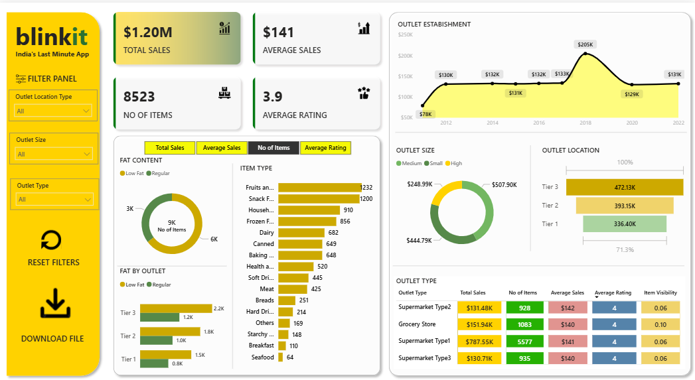

# 🛒 Blinkit Sales Performance Analysis

### An Interactive Power BI Dashboard for Uncovering Business Insights

This repository contains the Power BI project for a deep-dive analysis into Blinkit's sales data. The goal of this dashboard is to move beyond raw numbers and provide actionable insights that can inform business strategy, from inventory management to market expansion.

---

## 📊 Dashboard Preview



---

## ✨ Key Features

The dashboard is designed to be fully interactive and user-friendly, allowing stakeholders to explore the data from multiple perspectives.

| Feature | Description |
| :--- | :--- |
| **📈 Executive KPI Summary** | At-a-glance cards for **Total Sales ($1.20M)**, **Average Sales ($141)**, **Item Count (8.5K)**, and **Average Rating (3.9/5)**. |
| **🔬 Dynamic Filter Panel** | Slice the entire dataset by **Outlet Establishment Year**, **Location Type (Tier 1/2/3)**, **Outlet Size**, and **Item Category**. |
| **🍰 Sales Breakdown Visuals**| Interactive charts that analyze sales performance by **Item Fat Content**, **Outlet Size**, **Item Type**, and **Location**. |
| **🏢 Outlet Performance View**| A dedicated table comparing different **Outlet Types** (e.g., Supermarket vs. Grocery Store) across all key metrics. |

---

## 💡 Actionable Insights Uncovered

This analysis revealed several key trends that can directly inform strategic decisions.

> ### 1. The Health-Conscious Consumer is a Priority
> **Finding:** Low-fat products dominate the market, accounting for nearly **65% of all sales**.
> **Recommendation:** Increase stock and marketing focus on healthy-option products. Prioritize premium placement for the low-fat category.

> ### 2. The Ideal Store Blueprint is Clear
> **Finding:** **Medium-sized outlets** located in **Tier 3 cities** are the most profitable combination, driving the highest sales volume.
> **Recommendation:** Model future expansion plans on this successful blueprint. Analyze the operational efficiency of these specific stores to replicate their success elsewhere.

> ### 3. Core Product Categories Drive Business
> **Finding:** **Fruits & Vegetables** and **Snack Foods** are the undisputed top-selling categories.
> **Recommendation:** Protect the supply chain for these core items and leverage their popularity in promotional bundles to lift sales of other products.

---

## 🛠️ Technical Snapshot

* **BI Tool:** Microsoft Power BI
* **Core Language:** DAX (Data Analysis Expressions)
* **Data Source:** `BlinkIT Grocery Data.csv`

---

## 🚀 How to Use This Project

1.  **Clone the repository:**
    ```bash 
    git clone [https://github.com/VijaySaiBorru/BlinkIt_Analysis.git](https://github.com/VijaySaiBorru/BlinkIt_Analysis.git)
    ```
2.  **Launch the Dashboard:**
    * Open the `.pbix` project file using Power BI Desktop.
3.  **Explore:**
    * Interact with the filters and click on chart elements to drill down into the data.
